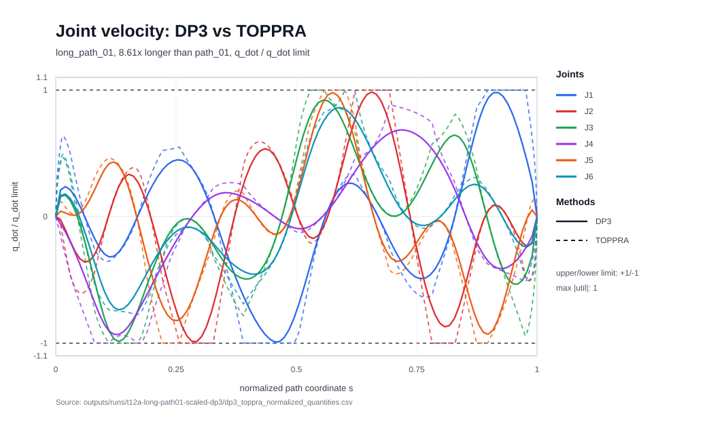
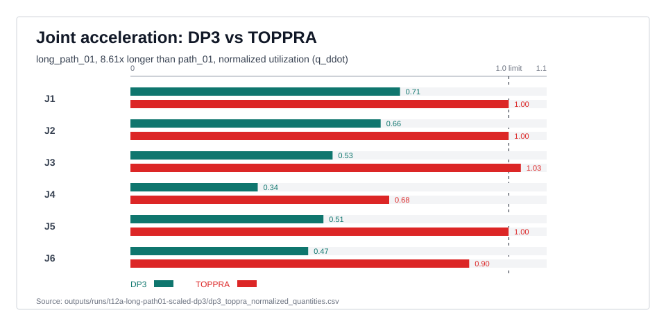
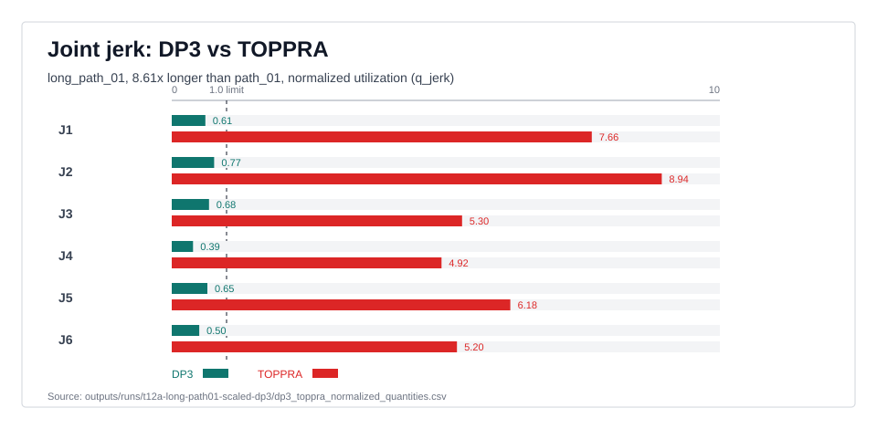
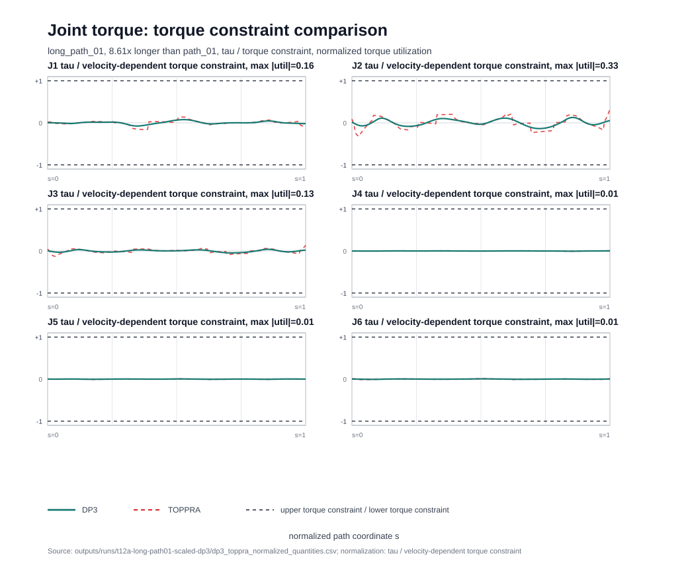

# dp3-topp

`dp3-topp` is a Python library and CLI for DP3/DP2 time-optimal path
parameterization experiments. It exposes the current DP3 algorithm as both a
low-level optimizer API and a higher-level workflow API that can load path and
limit files, run the optimizer, audit constraints, and optionally write the same
CSV/JSON artifacts used by the command-line tools.

## Normalized long-path joint comparisons

The homepage figures use the harder `long_path_01` case, whose joint-space
length is 8.61x longer than `path_01`. Each chart shows joint-data curves over
normalized path coordinate, comparing normalized utilization between DP3 and
TOPPRA across all six joints.









## Install

```powershell
python -m pip install -e .
```

For development:

```powershell
python -m pip install -e ".[dev]"
```

The plotting command imports `matplotlib` only when plotting is used. Install it
separately in environments that need `dp3-plot`.

## Low-level API

```python
import numpy as np
from dp3_topp import ConstraintLimits, DP3Config, PathData, optimize_dp3

s = np.linspace(0.0, 1.0, 21)
q = s[:, None]
path = PathData(
    s=s,
    q=q,
    q_s=np.ones_like(q),
    q_ss=np.zeros_like(q),
    q_sss=np.zeros_like(q),
)
limits = ConstraintLimits(
    q_dot_abs=np.array([1.0]),
    q_ddot_abs=np.array([5.0]),
    q_jerk_abs=np.array([50.0]),
    tau_abs=np.array([100.0]),
    tau_rate_abs=np.array([100.0]),
    mechanical_power_lower=-100.0,
    mechanical_power_upper=100.0,
)

result = optimize_dp3(path=path, limits=limits, config=DP3Config(ns=6, nz=8, nch=7))
print(result.feasible, result.total_time)
```

## High-level API

```python
from dp3_topp import DP3Config, run_dp3

run = run_dp3(
    path="dyn - 副本/paths/path_01.csv",
    limits="dyn - 副本/models/T12A/limits.yaml",
    model="dyn - 副本/models/T12A/T12A-14.xml",
    config=DP3Config(ns=40, nz=500, nch=20),
    out_dir="outputs/runs/path_01_library",
    constraint_check_points=600,
    time_samples=200,
)

print(run.status, run.summary["total_time"])
```

A runnable in-memory demo is available at `examples/library_call_demo.py`:

```powershell
python examples/library_call_demo.py --out-dir outputs/demo_library_call
```

## CLI

```powershell
dp3-run --path-csv "dyn - 副本/paths/path_01.csv" `
  --limits "dyn - 副本/models/T12A/limits.yaml" `
  --model "dyn - 副本/models/T12A/T12A-14.xml" `
  --out-dir outputs/runs/path_01_cli
```

Useful commands:

- `dp3-validate-data`
- `dp3-build-path`
- `dp3-run`
- `dp3-plot`
- `dp3-write-limits-template`
- `dp3-write-path-index-template`

## Tests

```powershell
pytest -q
```

The `outputs/` directory is treated as generated data and is not part of the
package artifact.
