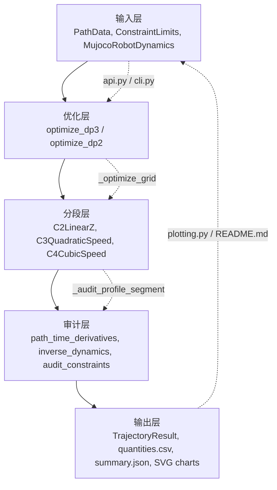
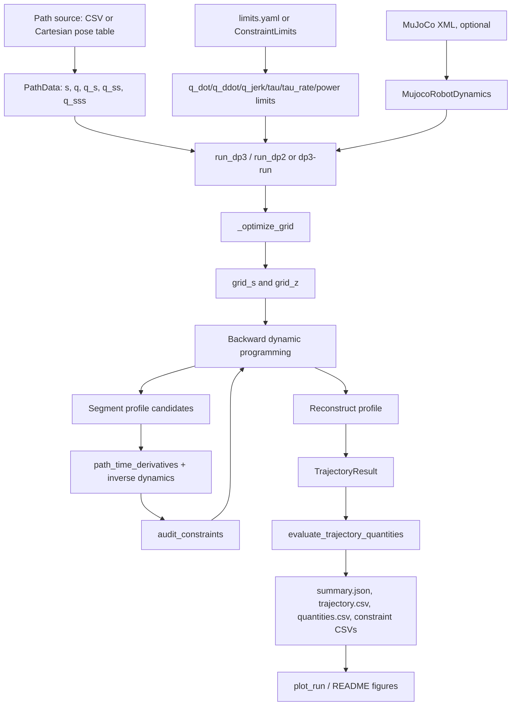
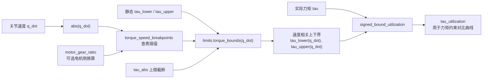
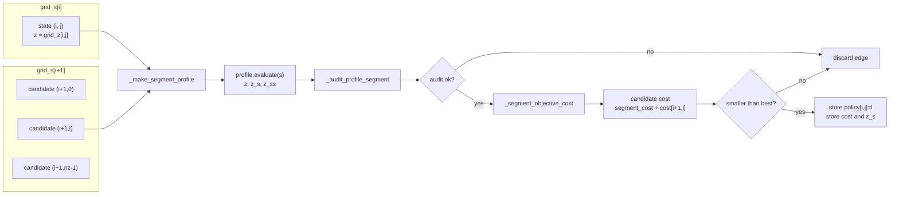
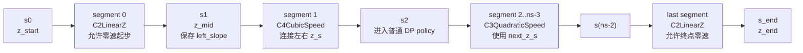
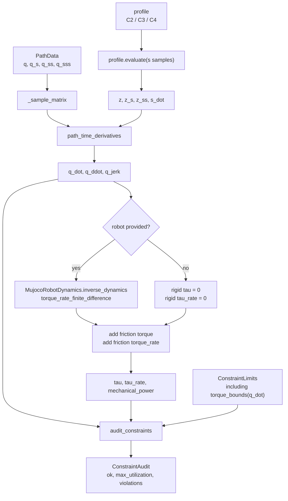
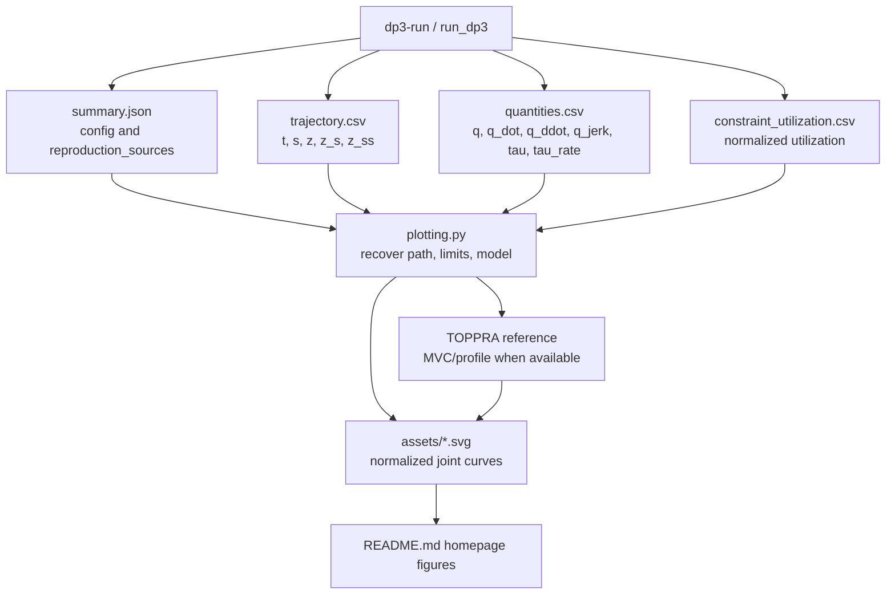

# DP3-TOPP 代码级算法流程说明

本文面向当前 `dp3-topp` 仓库源码，尽可能详细说明 DP3 算法在代码中的数据流、数学变量、动态规划过程、约束审计、动力学计算、DP2 基线和 TOPPRA 对比图生成逻辑。文档以“读代码能对应上”为目标，不把实现解释成脱离源码的抽象理论。

适用源码范围：

- `src/dp3_topp/optimizer.py`
- `src/dp3_topp/interpolation.py`
- `src/dp3_topp/kinematics.py`
- `src/dp3_topp/constraints.py`
- `src/dp3_topp/dynamics_mujoco.py`
- `src/dp3_topp/api.py`
- `src/dp3_topp/cli.py`
- `src/dp3_topp/plotting.py`
- `src/dp3_topp/cartesian_path.py`
- `README.md`

## 1. 一句话总览

当前库把一条已经离散化并带有路径导数的关节路径 `q(s)` 输入进来，在归一化路径参数 `s in [0, 1]` 上搜索路径速度平方 `z = s_dot^2` 的最优剖面。DP3 使用三阶约束需要的 `z_s` 和 `z_ss` 信息，通过 C2/C3/C4 分段速度曲线构造可审计的连续剖面；每个候选段都被速度、加速度、jerk、力矩、力矩变化率、机械功率和可选关节位置约束过滤，最终得到满足约束且总代价最小的时间参数化轨迹。

这里的 DP3 和 DP2 共享同一个网格动态规划骨架：

- DP3：优化时保留 jerk 和 torque-rate 约束，分段曲线包含 `C2LinearZ`、`C3QuadraticSpeed`、`C4CubicSpeed`。
- DP2：默认用二阶基线，只用 `C2LinearZ`，优化阶段可放松 jerk 和 torque-rate，最后仍用真实约束审计，所以 DP2 的输出可以用于暴露三阶约束违反。

## 2. 源码地图

| 模块 | 作用 |
| --- | --- |
| `optimizer.py` | 核心优化器。定义 `DP3Config`、`TrajectoryResult`、`TrajectoryQuantities`，实现 `optimize_dp3`、`optimize_dp2`、`_optimize_grid`、分段重构、约束审计和动态量计算。 |
| `interpolation.py` | 分段速度剖面。`C2LinearZ` 直接线性插值 `z`；`C3QuadraticSpeed` 用二次多项式表示路径速度 `s_dot`；`C4CubicSpeed` 用三次多项式连接两端斜率。 |
| `kinematics.py` | 路径导数到时间导数的链式求导。核心函数是 `path_time_derivatives`。 |
| `constraints.py` | 约束模型、YAML 解析、速度相关力矩边界、摩擦、驱动功率和统一审计。核心函数是 `audit_constraints`。 |
| `dynamics_mujoco.py` | MuJoCo 模型封装。`MujocoRobotDynamics` 负责加载 XML、筛选关节、逆动力学和力矩变化率有限差分。 |
| `api.py` | 对外库化入口。`run_dp3` 和 `run_dp2` 做输入转换、运行优化、审计并可写出 CSV/JSON。 |
| `cli.py` | 命令行入口。`dp3-run`、`dp3-build-path`、`dp3-validate-data` 等都在这里实现。 |
| `plotting.py` | 从 run artifact 生成 SVG 图，包括关节量曲线、约束利用率、DP3/DP2 对比和 TOPPRA MVC 参考曲线。 |
| `cartesian_path.py` | 可选路径构建层。把 Cartesian pose table 通过 MuJoCo IK 变成 `PathData`。 |
| `README.md` | 包主页和使用说明，当前包含长复杂路径的归一化关节速度、加速度、jerk 和力矩对比图。 |

## 3. 图文速览：算法实现的几张关键图

这一节先把后文的核心实现用图集中说明。所有图都对应当前源码中的真实函数和 artifact，不是额外设计出来的抽象流程。

### 3.1 五层实现视图



这张图可以理解为库化后的架构边界：

- 输入层负责把路径、约束、机器人模型变成强类型对象。
- 优化层负责在 `z-s` 网格上做动态规划。
- 分段层负责把离散状态转成可计算 `z/z_s/z_ss` 的连续剖面。
- 审计层负责把剖面换算成关节速度、加速度、jerk、力矩、力矩变化率和功率，再做约束过滤。
- 输出层负责把结果写成 CSV/JSON，并进一步生成主页里的关节数据图。

### 3.2 总体数据流



高层调用链有两条常见路径：

1. 库调用：`run_dp3(...)` 或 `run_dp2(...)`。
2. CLI 调用：`dp3-run --method dp3|dp2|compare ...`。

两者最终都会进入同一套核心函数：

```text
optimize_dp3 / optimize_dp2
  -> _optimize_grid
       -> _make_segment_profile
       -> _audit_profile_segment
       -> _segment_objective_cost
       -> _solve_dp3_algorithm3_start
       -> _reconstruct_profile
       -> _audit_samples
  -> evaluate_trajectory_quantities
```

## 4. 核心数学变量

当前实现使用归一化路径参数 `s`，不是直接在时间 `t` 上搜索关节轨迹。路径本身是 `q(s)`，优化变量是路径速度平方：

```text
z = s_dot^2
z_s = dz / ds
z_ss = d2z / ds2
```

选择 `z = s_dot^2` 的原因是很多二阶约束可以写成对 `z` 和 `z_s` 更容易审计的形式。DP3 还要处理三阶量，所以实现继续保存 `z_ss`。

`kinematics.py` 的 `path_time_derivatives` 使用如下链式求导：

```text
q_dot  = q_s * sqrt(z)
q_ddot = q_ss * z + 0.5 * q_s * z_s
q_jerk = q_sss * z * sqrt(z)
         + 1.5 * q_ss * sqrt(z) * z_s
         + 0.5 * q_s * sqrt(z) * z_ss
```

这些公式是整个实现的核心。约束审计、MuJoCo 逆动力学、力矩变化率和输出曲线都建立在这些时间导数上。

## 5. 输入路径：`PathData`

`PathData` 位于 `path_data.py`，包含：

```python
PathData(
    s=...,
    q=...,
    q_s=...,
    q_ss=...,
    q_sss=...,
)
```

字段含义：

- `s`：一维数组，必须严格递增，并且覆盖 `[0, 1]`。
- `q`：每个 `s` 采样点的关节位置，形状为 `(samples, dof)`。
- `q_s`：`dq/ds`。
- `q_ss`：`d2q/ds2`。
- `q_sss`：`d3q/ds3`。

`PathData.from_csv` 读取的 CSV 需要包含：

- `s`
- `q1..qn`
- `dq1_ds..dqn_ds`，也兼容 `dq1..dqn`
- `d2q1_ds2..d2qn_ds2`，也兼容 `d2q1..d2qn`
- `d3q1_ds3..d3qn_ds3`，也兼容 `d3q1..d3qn`

如果输入是 Cartesian pose table，`cartesian_path.py` 会先做 IK：

1. `parse_pose_table` 读取每行至少 6 列：`x y z rz ry rx`。
2. `build_joint_path_result_from_cartesian` 调用 MuJoCo 做迭代 IK。
3. 用末端位置弧长构造归一化 `s`。
4. 用 `np.gradient` 对 `q(s)` 求 `q_s`、`q_ss`、`q_sss`。
5. 返回 `PathData` 和 IK 诊断信息。

因此核心优化器不关心路径来自 CSV 还是 IK，只要求最后形成合法的 `PathData`。

## 6. 约束模型：`ConstraintLimits`

`ConstraintLimits` 位于 `constraints.py`，是所有物理约束的统一容器。它支持以下约束：

- `q_dot`：关节速度。
- `q_ddot`：关节加速度。
- `q_jerk`：关节 jerk。
- `tau`：关节力矩。
- `tau_rate`：关节力矩变化率。
- `mechanical_power`：机械功率上下界。
- `q_position`：可选关节位置上下界。

每个关节轴向约束都可以用两种方式配置：

- 绝对值形式：如 `q_dot_abs`。
- 显式上下界形式：如 `q_dot.lower` 和 `q_dot.upper`。

如果只给绝对值，代码会归一成对称上下界：

```text
lower = -abs_limit
upper =  abs_limit
```

如果给显式上下界，代码要求：

```text
lower < 0 < upper
```

### 6.1 速度相关力矩边界

当前实现里的力矩约束不是只能是固定 `tau_abs`。如果 `limits.yaml` 中配置了 `torque_speed_breakpoints`，`ConstraintLimits.torque_abs_limit(q_dot)` 会根据关节速度插值得到速度相关的力矩上限。

速度相关力矩边界示意：



这也是 README 主页力矩图里提到的 `velocity-dependent torque constraint`。力矩利用率不是简单的 `tau / tau_abs`，而是：

```text
tau_lower(q_dot), tau_upper(q_dot) = limits.torque_bounds(q_dot)
tau_utilization = signed_bound_utilization(tau, tau_lower, tau_upper)
```

具体逻辑：

1. 先用静态上下界得到 `static_lower/static_upper`。
2. 如果没有 torque-speed 表，速度相关上限就是 `tau_abs`。
3. 如果有 torque-speed 表，则对每个轴按 `abs(q_dot)` 查表插值。
4. 如果配置了 `motor_gear_ratio`，查表速度使用电机侧速度 `abs(q_dot) * gear_ratio`，输出力矩按 gear ratio 缩放。
5. 最终速度相关上限还会和 `tau_abs` 取更小值。
6. 返回：

```text
lower = max(static_lower, -speed_abs)
upper = min(static_upper,  speed_abs)
```

所以力矩曲线、力矩约束曲线、归一化力矩利用率必须和关节速度同时解释。

### 6.2 摩擦和功率

`ConstraintLimits` 还支持摩擦和电机功率模型：

- Coulomb friction：`friction_coulomb`
- viscous friction：`friction_viscous`
- motor gear ratio：`motor_gear_ratio`
- motor torque constant：`motor_torque_constant`
- motor stator resistance：`motor_stator_resistance`

摩擦力矩：

```text
friction_torque = sign(q_dot) * coulomb + q_dot * viscous
```

摩擦力矩变化率：

```text
friction_torque_rate = q_ddot * viscous
```

驱动功率 `drive_power` 需要完整电机模型。优化代价中的 `k2` 大于 0 时，代码会强制要求 motor power model 完整，否则抛出错误。

## 7. 动力学模型：`MujocoRobotDynamics`

`MujocoRobotDynamics` 位于 `dynamics_mujoco.py`。它的职责是把 MuJoCo XML 模型接入优化器：

1. `from_model_path` 加载 XML 和同目录资源。
2. 只选择 hinge joint。
3. 如果模型有 actuator，优先选择被 actuator 关联的 hinge joint。
4. 读取关节名、`dof_indices`、`qpos_indices`、关节上下限。
5. 要求选中关节都有有限 joint range。

核心动力学函数有两个：

```python
inverse_dynamics(q, qd, qdd)
torque_rate_finite_difference(q, qd, qdd, qddd, dt=...)
```

`inverse_dynamics` 的流程：

1. 创建 `mujoco.MjData`。
2. 把输入的 `q`、`qd`、`qdd` 写入被选关节。
3. 调用 `mujoco.mj_inverse`。
4. 取 `data.qfrc_inverse + data.qfrc_passive` 的选中 DOF。

`torque_rate_finite_difference` 用中心差分估计 `d tau / dt`：

1. 用当前 `q, qd, qdd, qddd` 对半步 `dt/2` 做泰勒展开，得到 plus/minus 状态。
2. 分别调用 `inverse_dynamics`。
3. 返回 `(tau_plus - tau_minus) / dt`。

优化器中的 `_evaluate_dynamic_quantities` 会在 MuJoCo 力矩基础上再加摩擦：

```text
tau      = inverse_dynamics(...) + friction_torque(q_dot)
tau_rate = finite_difference(...) + friction_torque_rate(q_ddot)
power    = sum(tau * q_dot)
```

如果没有传入 robot，代码会把刚体力矩和力矩变化率设为 0，但仍然加摩擦项。因此没有 MuJoCo 模型时，力矩约束审计并不等价于真实机器人动力学审计。

## 8. 公开库入口：`run_dp3` 和 `run_dp2`

`api.py` 是库化后的主要调用层，适合 demo、脚本或外部工程集成。

### 8.1 `run_dp3`

```python
from dp3_topp import DP3Config, run_dp3

run = run_dp3(
    path="path.csv",
    limits="limits.yaml",
    model="robot.xml",
    config=DP3Config(ns=40, nz=500, nch=20),
    out_dir="outputs/runs/example",
    constraint_check_points=600,
    time_samples=200,
)
```

内部流程：

1. `_coerce_path`：如果输入是 `PathData`，直接使用；如果是路径字符串，则调用 `PathData.from_csv`。
2. `_coerce_limits`：如果输入是 `ConstraintLimits`，直接使用；如果是 YAML，则调用 `ConstraintLimits.from_yaml`。
3. `_coerce_robot`：如果传入 `MujocoRobotDynamics`，直接使用；如果传入 `model`，加载 MuJoCo XML。
4. 检查 path、limits、robot DOF 一致。
5. 如果有 robot，检查路径关节位置没有超出 MuJoCo joint range。
6. 调用 `optimize_dp3`。
7. 调用 `evaluate_trajectory_quantities`。
8. 进行可选密集约束审计。
9. 组装 summary。
10. 如果传入 `out_dir`，写出 CSV 和 JSON。

返回对象是 `DPToppRunResult`，包含：

- `status`：0 表示最终审计可行，1 表示不可行。
- `result`：`TrajectoryResult`。
- `quantities`：`TrajectoryQuantities`。
- `check_result`：用于最终约束审计的轨迹采样。
- `check_quantities`：最终审计采样点上的动态量。
- `check_audit`：`ConstraintAudit`。
- `summary`：和 `summary.json` 同结构的字典。
- `out_dir`、`summary_path`。

### 8.2 `run_dp2`

`run_dp2` 的外部形式和 `run_dp3` 基本一致，但多了：

```python
jerk_limited="no" | "only start / end" | "yes"
```

含义：

- `"no"`：优化阶段放松 jerk 和 tau-rate，用 DP2 二阶基线。
- `"only start / end"`：只在起止附近或零速相邻段使用真实三阶限制，其余段放松。
- `"yes"`：优化阶段也使用真实 jerk 和 tau-rate 限制，但仍使用 DP2 的 C2 分段形式。

注意：即使 DP2 优化阶段放松了三阶约束，最终 summary 和 `constraint_violations.csv` 仍使用原始 `limits` 做审计。这是比较 DP3 和 DP2 时很关键的实现细节。

## 9. CLI 入口：`dp3-run`

`pyproject.toml` 中注册的命令行入口包括：

```text
dp3-run = "dp3_topp.cli:run_main"
dp3-plot = "dp3_topp.plotting:plot_main"
dp3-build-path = "dp3_topp.cli:build_path_main"
dp3-validate-data = "dp3_topp.cli:validate_data_main"
```

`dp3-run` 支持三种 method：

```text
--method dp3
--method dp2
--method compare
```

单路径常见命令：

```powershell
dp3-run --method dp3 `
  --path-csv "dyn - 副本/paths/path_01.csv" `
  --limits "dyn - 副本/models/T12A/limits.yaml" `
  --model "dyn - 副本/models/T12A/T12A-14.xml" `
  --out-dir outputs/runs/path_01_dp3 `
  --constraint-check-points 600 `
  --time-samples 200
```

`compare` 会在同一个输出目录下分别生成：

```text
out_dir/
  dp3/
    summary.json
    trajectory.csv
    quantities.csv
    constraint_utilization.csv
    constraint_violations.csv
  dp2/
    summary.json
    trajectory.csv
    quantities.csv
    constraint_utilization.csv
    constraint_violations.csv
  comparison_metrics.csv
  comparison_summary.json
```

如果提供 `--path-index`，CLI 会批量运行多个路径，并生成 batch summary 和 comparison metrics。

## 10. `DP3Config`

`DP3Config` 定义在 `optimizer.py`：

```python
@dataclass(frozen=True)
class DP3Config:
    ns: int = 40
    nz: int = 500
    nch: int = 20
    k1: float = 1.0
    k2: float = 0.0
    z_start: float = 0.0
    z_end: float = 0.0
    z_max: float | None = None
    tau_rate_dt: float = 1e-5
```

字段解释：

- `ns`：路径方向的网格点数。DP3 要求至少 4，因为起始两段有特殊 C2/C4 构造。
- `nz`：每个 `s` 网格点上的 `z` 候选数量。
- `nch`：每个候选段上的约束检查采样点数。
- `k1`：时间代价权重。
- `k2`：驱动功率积分代价权重。
- `z_start`：起点路径速度平方。
- `z_end`：终点路径速度平方。
- `z_max`：可选全局 `z` 上限。
- `tau_rate_dt`：力矩变化率有限差分时间步长。

代价函数：

```text
segment_cost = k1 * segment_duration + k2 * drive_energy_like_cost
```

当 `k2 == 0` 时，优化目标就是最小时间。当 `k2 > 0` 时，代码对 `drive_power / s_dot` 沿 `s` 做 Gauss-Legendre 积分，因为：

```text
dt = ds / s_dot
energy-like integral = integral drive_power dt
                     = integral drive_power / s_dot ds
```

## 11. DP3 核心：`optimize_dp3`

`optimize_dp3` 是非常薄的一层包装：

```python
def optimize_dp3(...):
    return _optimize_grid(
        method="DP3",
        jerk_limited="yes",
        use_dp3_profiles=True,
        optimization_limits=limits,
    )
```

真正算法在 `_optimize_grid`。

## 12. `_optimize_grid` 详细流程

### 12.1 参数校验

`_optimize_grid` 首先检查：

- `ns >= 3`，DP3 还要求 `ns >= 4`。
- `nz >= 2`。
- `nch >= 2`。
- `k1/k2` 非负且至少一个大于 0。
- `tau_rate_dt` 为正。
- `z_start/z_end` 非负。
- 如果提供 `z_max`，要求为正，且起止 `z` 不能超过它。
- 如果 `k2 > 0`，limits 必须有完整 motor power model。

然后调用 `_validate_boundary_speed_limits` 检查起止速度：

```text
q_dot_at_boundary = q_s(boundary) * sqrt(z_boundary)
```

如果起点或终点给定速度已经超过 `q_dot` 约束，直接报错。

### 12.2 构造 `grid_s`

```python
grid_s = np.linspace(path.s[0], path.s[-1], ns)
```

当前路径域固定是 `[0, 1]`，所以 `grid_s` 通常就是归一化路径上的均匀网格。

### 12.3 构造每个网格点的 `z` 上界

`_z_ceiling(path, limits, grid_s, config.z_max)` 根据速度约束生成每个 `s_i` 上的 `z` 上限。

对每个样本点和每个关节轴：

```text
q_dot = q_s * sqrt(z)
```

如果某个轴 `q_s_axis` 不为 0，就能由速度上下界反推允许的路径速度：

```text
speed_limit = q_dot_upper / q_s_axis    if q_s_axis > 0
speed_limit = q_dot_lower / q_s_axis    if q_s_axis < 0
z_limit = max(speed_limit, 0)^2
```

每个 `s_i` 的上界取所有相关关节轴的最小值，再和 `z_max` 取最小。这样 DP 网格一开始就不会考虑明显违反速度约束的 `z` 状态。

### 12.4 构造 `grid_z`

```python
grid_z = np.vstack([
    np.linspace(0.0, max(float(zi), 1e-12), nz)
    for zi in z_ceiling
])
grid_z[0, 0] = z_start
grid_z[-1, 0] = z_end
```

也就是说：

- 每一行代表某个 `s_i` 上的所有 `z` 候选。
- 第 0 个候选槽位被用作起点或终点边界状态。
- 终点只允许 `grid_z[-1, 0] = z_end` 作为有效终态。

### 12.5 动态规划表

核心 DP 表：

```python
cost = np.full((ns, nz), np.inf)
policy = np.full((ns, nz), -1)
stored_z_s = np.zeros((ns, nz))
cost[-1, 0] = 0.0
```

含义：

- `cost[i, j]`：从状态 `(s_i, z_ij)` 到终点的最小未来代价。
- `policy[i, j]`：最佳下一状态在 `grid_z[i + 1]` 中的索引。
- `stored_z_s[i, j]`：从该状态出发的最佳段在左端点的 `z_s`，供前一段构造更高阶连续性使用。
- `cost[-1, 0] = 0`：只有终点边界速度是合法终态。

DP 状态转移图：



图里的每条边都是真实候选段：只有能通过 `audit_constraints` 的边才有资格进入 `policy`。这也是 DP3 和只做后验检查的实现最关键的区别之一。

### 12.6 反向递推

DP 从倒数第二个路径网格点向前递推。DP3 的普通递推从 `i = ns - 2` 到 `i = 2`，把前两段交给 `_solve_dp3_algorithm3_start` 特殊处理。DP2 没有特殊起始处理，从 `i = ns - 2` 一直递推到 `i = 0`。

每个状态 `(i, j)` 尝试所有下一状态 `(i + 1, l)`：

1. 如果 `cost[i + 1, l]` 不是有限值，跳过。
2. 如果下一层是终点，只允许 `l == 0`。
3. 根据当前 `z_i`、下一 `z_n`、下一状态保存的 `z_s` 构造分段 profile。
4. 用 `_optimization_limits_for_segment` 决定这个段用真实约束还是 DP2 放松约束。
5. `_audit_profile_segment` 在该段上采样 `nch` 个点，检查所有约束。
6. `_segment_objective_cost` 计算该段代价。
7. 加上未来代价 `cost[i + 1, l]`。
8. 如果总成本更小，则更新 `cost/policy/stored_z_s`。

伪代码：

```text
for i from ns-2 down to first_i:
    for each z_i in grid_z[i]:
        best = inf
        for each z_next in grid_z[i+1]:
            if next state infeasible:
                continue
            profile = _make_segment_profile(...)
            if profile invalid:
                continue
            audit = _audit_profile_segment(...)
            if audit failed:
                continue
            segment_cost = _segment_objective_cost(...)
            candidate = segment_cost + cost[i+1, next]
            if candidate < best:
                store candidate
```

这个过程不是先生成一条速度曲线再整体检查，而是每个候选段都在 DP 中即时审计，不满足约束的边不会进入最优路径。

## 13. 分段 profile：C2、C3、C4

分段速度曲线在 `interpolation.py` 中实现，统一返回：

```python
ProfileValues(
    s=...,
    z=...,
    z_s=...,
    z_ss=...,
    s_dot=...
)
```

C2/C4/C3 分段示意：



这张图对应 `_reconstruct_profile` 中的段类型选择：DP3 的第一段和最后一段用 C2，第二段用 C4，中间段尽量用 C3。C2 负责处理可能的零速边界，C4 负责起始处斜率衔接，C3 负责大部分路径上的三阶剖面。

### 13.1 `C2LinearZ`

`C2LinearZ` 直接对 `z` 做线性插值：

```text
z(s) = linear interpolation between z0 and z1
z_s = constant
z_ss = 0
```

它允许端点速度为 0。代码中 DP2 全部使用 `C2LinearZ`。DP3 的第一段和最后一段也强制使用 C2。

### 13.2 `C3QuadraticSpeed`

`C3QuadraticSpeed` 不是直接插值 `z`，而是把路径速度 `s_dot` 表示为二次多项式：

```text
p(xi) = c0 + c1 * xi + c2 * xi^2
z = p(xi)^2
```

其中 `xi = (s - s1) / h`，区间内 `xi in [-1, 0]`。

它由以下条件确定：

- 左端速度平方 `z0`。
- 右端速度平方 `z1`。
- 右端 `z_s1`。

为什么用右端斜率？因为 DP 是从终点向起点递推，下一状态已经知道自己向左需要什么斜率，当前段就可以用这个 `next_z_s` 构造出更平滑的连接。

`C3QuadraticSpeed` 要求端点速度为正，并会检查整个区间内速度保持为正，否则该 profile 无效。

### 13.3 `C4CubicSpeed`

`C4CubicSpeed` 用三次多项式表示 `s_dot`：

```text
p(xi) = d + c * xi + b * xi^2 + a * xi^3
z = p(xi)^2
```

它由以下条件确定：

- 左端 `z0`。
- 右端 `z1`。
- 左端 `z_s0`。
- 右端 `z_s1`。

当前 DP3 只在起始后的第二段使用 C4。它连接第一段 C2 产生的左端斜率和后续 DP 已经存储的右端斜率。

### 13.4 DP3 的段类型分布

成功重构后，DP3 通常形成：

```text
segment 0          : C2
segment 1          : C4
segment 2..ns-3    : C3
segment ns-2       : C2
```

如果中间段出现零速端点，`C3QuadraticSpeed` 会被视为无效，因此可行 DP 路径会避开这类过渡，或者最终该段不会作为 C3 成立。

## 14. DP3 起始两段特殊处理

DP3 普通反向递推从 `i = 2` 开始，不直接求起点两段。起点两段由 `_solve_dp3_algorithm3_start` 处理。

原因是：

- 起点 `z_start` 常常为 0。
- C3/C4 profile 要求正速度端点。
- 第一段需要允许从 0 起步。
- 第二段需要把第一段产生的斜率和后续 DP 的斜率连接起来。

流程：

1. 固定起点 `z_start = grid_z[0, 0]`。
2. 枚举第一中间点 `z_mid = grid_z[1, j]`，代码从 `j = 1` 开始，避免中间速度为 0。
3. 用 `C2LinearZ(s0, s1, z_start, z_mid)` 构造第一段。
4. 审计第一段约束。
5. 取第一段在 `s1` 处的 `left_slope`。
6. 枚举第二中间点 `z_next = grid_z[2, l]`，要求 `cost[2, l]` 已可行。
7. 用 `C4CubicSpeed(s1, s2, z_mid, z_next, left_slope, stored_z_s[2, l])` 构造第二段。
8. 审计第二段约束。
9. 计算 `c2_cost + c4_cost + cost[2, l]`。
10. 保存最优的 `policy[0,0]` 和 `policy[1,best_j]`。

这对应源码中的：

```text
_solve_dp3_algorithm3_start
  -> C2LinearZ.from_interval(...)
  -> C4CubicSpeed.from_interval(...)
  -> _audit_profile_segment(...)
  -> _segment_objective_cost(...)
```

## 15. 约束审计：从 profile 到 `audit_constraints`

每个候选段都会调用 `_audit_profile_segment`：

约束审计链路图：



```python
s = np.linspace(profile.s0, profile.s1, nch)
values = profile.evaluate(s)
return _audit_samples(path, limits, values.s, values.z, values.z_s, values.z_ss, robot)
```

`_audit_samples` 做两件事：

1. `_evaluate_dynamic_quantities` 计算 `q_dot/q_ddot/q_jerk/tau/tau_rate/power`。
2. `audit_constraints` 统一检查上下界。

### 15.1 `_evaluate_dynamic_quantities`

输入是若干 `s` 点和对应的 `z/z_s/z_ss`。流程：

1. 从 `PathData` 中插值得到 `q`、`q_s`、`q_ss`、`q_sss`。
2. 调用 `path_time_derivatives` 得到 `q_dot`、`q_ddot`、`q_jerk`。
3. 如果有 MuJoCo robot：
   - 对每个采样点调用 `robot.inverse_dynamics(q, q_dot, q_ddot)`。
   - 对每个采样点调用 `robot.torque_rate_finite_difference(q, q_dot, q_ddot, q_jerk)`。
4. 如果没有 robot，刚体力矩和力矩变化率先置 0。
5. 加上摩擦力矩和摩擦力矩变化率。
6. 机械功率为 `sum(tau * q_dot)`。

这意味着 jerk 约束和 tau-rate 约束不是在轨迹末尾补算的附加指标，而是在 DP 候选段筛选阶段就参与可行性判断。

### 15.2 `audit_constraints`

`audit_constraints` 对以下量逐项检查：

- `q_position`，如果配置了位置边界。
- `q_dot`
- `q_ddot`
- `q_jerk`
- `tau`
- `tau_rate`
- `mechanical_power`

对双边轴向约束，利用率用 `signed_bound_utilization`：

```text
value >= 0: utilization = value / upper
value < 0 : utilization = value / abs(lower)
```

对位置这种非零中心区间，利用率用 `interval_bound_utilization`：

```text
center = 0.5 * (lower + upper)
half_width = 0.5 * (upper - lower)
utilization = (value - center) / half_width
```

对机械功率，正值除以上界，负值除以下界绝对值。

返回对象：

```python
ConstraintAudit(
    ok=...,
    max_utilization={...},
    violations=[ConstraintViolation(...), ...],
)
```

DP 阶段只接受 `audit.ok == True` 的候选段。

## 16. 轨迹重构：`_reconstruct_profile`

当 `cost[0, 0]` 有限时，说明从起点边界状态到终点边界状态存在可行策略。`_reconstruct_profile` 沿着 `policy` 从前往后重构整条轨迹。

重构过程：

1. 从 `j = 0` 开始。
2. 对每个 segment `i`，读取 `l = policy[i, j]`。
3. 根据 DP3 或 DP2 构造对应 profile。
4. 计算该段 duration。
5. 在该段上取 `nch` 个采样点。
6. 用 `_profile_elapsed_at_samples` 把局部 `s` 转换成局部时间。
7. 拼接到全局 `t/s/z/z_s/z_ss`。
8. 更新 `j = l` 进入下一段。

第一段之后会去掉重复端点，避免相邻 segment 拼接时重复同一个 `s`。

返回：

```text
t_out
s_out
z_out
z_s_out
z_ss_out
segment_kinds
segment_profiles
total_time
```

然后 `_optimize_grid` 再用原始 `limits` 对完整重构轨迹执行一次 `_audit_samples`。最终的 `TrajectoryResult.feasible` 来自这次完整审计。

## 17. 输出对象：`TrajectoryResult`

`TrajectoryResult` 是优化器的核心输出：

```python
TrajectoryResult(
    feasible=...,
    t=...,
    s=...,
    z=...,
    z_s=...,
    z_ss=...,
    total_time=...,
    audit=...,
    grid_s=...,
    grid_z=...,
    policy=...,
    method="DP3" or "DP2",
    jerk_limited=...,
    segment_kinds=...,
    segment_profiles=...,
    tau_rate_dt=...,
    objective_cost=...,
    objective_time_cost=...,
    objective_drive_power_cost=...,
)
```

如果 DP 不可行，代码会返回空轨迹：

- `feasible=False`
- `t/s/z/z_s/z_ss` 为空数组
- `total_time=inf`
- `objective_cost=inf`
- `segment_kinds=[]`

但仍会构造一个空或零动态量的 `ConstraintAudit`，让上层 summary 能稳定写出失败信息。

## 18. 输出动态量：`TrajectoryQuantities`

`evaluate_trajectory_quantities` 把 `TrajectoryResult` 转成可画图、可统计的物理量：

- `q`
- `q_dot`
- `q_ddot`
- `q_jerk`
- `tau`
- `tau_rate`
- `mechanical_power`
- `drive_power`，如果有完整 motor model
- 每个量对应的 utilization

其中力矩利用率再次强调：

```text
tau_lower, tau_upper = limits.torque_bounds(q_dot)
tau_utilization = signed_bound_utilization(tau, tau_lower, tau_upper)
```

因此力矩曲线如果要体现“力矩约束下的比较”，应优先使用 `tau_utilization` 或同时画 `tau` 与随速度变化的 torque bound。

## 19. 密集约束检查

CLI 和 API 都支持 `constraint_check_points`。该逻辑在 `cli.py` 的 `_constraint_check_result` 中。

如果 `constraint_check_points > 0` 且轨迹非空：

1. 优先调用 `resample_trajectory_by_segments`。
2. 如果 `TrajectoryResult` 中有 `segment_profiles`，就按真实分段 profile 重采样。
3. `constraint_check_source = "dense_segment_profiles"`。
4. 如果没有 profile，就退化为在 `s` 上插值离散轨迹。
5. `constraint_check_source = "dense_s_grid"`。

如果没有要求密集检查，则直接使用优化器输出采样：

```text
constraint_check_source = "trajectory_samples"
```

密集检查结果会影响：

- `summary["feasible"]`
- `summary["max_utilization"]`
- `summary["violations"]`
- `constraint_utilization.csv`
- `constraint_violations.csv`

## 20. 写出的 CSV/JSON

单次运行成功后，库接口和 CLI 都会写出类似文件：

### 20.1 `trajectory.csv`

来自 `_write_trajectory`：

```text
t, s, z, z_s, z_ss
```

这是最接近优化器内部结果的文件。

### 20.2 `quantities.csv`

来自 `_write_quantities`：

```text
t, s, z, z_s, z_ss,
q1..qn,
q_dot1..q_dotn,
q_ddot1..q_ddotn,
q_jerk1..q_jerkn,
tau1..taun,
tau_rate1..tau_raten,
mechanical_power,
drive_power optional
```

这是关节速度、加速度、jerk、力矩、力矩变化率曲线的主要数据源。

### 20.3 `time_quantities.csv`

如果设置 `time_samples > 0`，会按均匀时间网格重新采样轨迹，再输出同样结构的动态量。

### 20.4 `constraint_utilization.csv`

来自密集检查采样，列为：

```text
t, s, z, q_dot, q_ddot, q_jerk, tau, tau_rate, mechanical_power, optional q_position
```

这里每个约束量已经 collapse 到每个采样点上的最大绝对利用率。

### 20.5 `constraint_violations.csv`

每个越界点一行：

```text
quantity, sample, axis, t, s, z, value, limit, utilization
```

### 20.6 `summary.json`

包含：

- `method`
- `feasible`
- `cpu_time_s`
- `total_time`
- `objective_cost`
- `segment_kinds`
- `constraint_check_source`
- `max_utilization`
- `active_constraint_percent`
- `most_restrictive_constraint_percent`
- `violations`
- `required_time_scale_st`
- `executable_with_st`
- `te_scale`
- `config`
- `reproduction_sources`

`required_time_scale_st` 的逻辑在 `cli.py` 中。它根据超限量估计如果按时间缩放，速度、加速度、jerk、tau-rate、power 需要缩放多少才能覆盖已知超限。但不是所有约束都能靠时间缩放覆盖，例如位置约束不在 `TIME_SCALE_EXPONENTS` 中。

## 21. DP2 基线如何和 DP3 对比

DP2 入口是 `optimize_dp2`。它和 DP3 的主要区别：

1. `use_dp3_profiles=False`，所以 `_make_segment_profile` 总是用 `C2LinearZ`。
2. `method="DP2"`。
3. `jerk_limited` 可控制优化阶段是否使用真实三阶限制。

当 `jerk_limited != "yes"` 时，代码会构造一个 `optimization_limits`：

```text
q_jerk_abs = 1e12
tau_rate_abs = 1e12
```

这相当于优化阶段忽略 jerk 和 tau-rate 限制，但保留速度、加速度、力矩、功率等限制。

最后 `_optimize_grid` 仍然用原始 `limits` 做完整审计。因此 DP2 结果可能：

- 优化阶段找到一条时间很短的轨迹。
- 最终 `summary["feasible"] = False`。
- `constraint_violations.csv` 显示 jerk 或 tau-rate 超限。

这就是 README 中把 DP3 和 TOPPRA/DP2 对比时需要强调三阶约束优势的基础。

## 22. TOPPRA 对比和主页关节图

`plotting.py` 中的 TOPPRA 相关逻辑主要用于生成参考曲线，而不是替代 DP3 优化器。

### 22.1 TOPPRA MVC

`_toppra_mvc_curve` 会尝试读取 run artifact 中的：

- `path_source`
- `limits`
- `model`

然后构造 TOPPRA：

```python
toppra_path = ta.SplineInterpolator(path.s, path.q)
constraints = [
    JointVelocityConstraint(...),
    JointAccelerationConstraint(...),
]
```

如果 MuJoCo model 可用，还会加入：

```python
JointTorqueConstraint(
    robot.inverse_dynamics,
    np.column_stack([limits.tau_lower, limits.tau_upper]),
    limits.friction_coulomb,
)
```

然后：

1. `compute_feasible_sets()` 得到每个 gridpoint 的可行 `z` 上界。
2. 开平方得到 MVC path speed。
3. 尝试 `compute_parameterization(start_speed, end_speed)` 得到 TOPPRA profile speed。

注意这里 TOPPRA 约束集是速度、加速度和力矩。DP3 额外审计 `q_jerk` 和 `tau_rate`，这正是对比时的算法差异。

### 22.2 README 主页图

当前 README 的主页图说明是：

输出文件到主页图的数据流：



- 使用较难的 `long_path_01`。
- 该路径关节空间长度是 `path_01` 的 8.61 倍。
- 横轴是归一化路径坐标 `s`。
- 图是关节数据曲线，不是装饰型图。
- 包含关节速度、加速度、jerk、力矩对比。
- 力矩图使用速度相关力矩约束归一化，即 `tau / torque constraint`。

这和用户要求的“关节数据曲线图、不要花里胡哨、在一条难的复杂长路径上归一化、力矩曲线要采用力矩约束的对比力距曲线”一致。源码层面应优先从 run artifact 的 `quantities.csv`、`constraint_utilization.csv`、limits 和 TOPPRA 曲线共同生成这些 SVG。

### 22.3 为什么 jerk 图能体现 DP3 优势

TOPPRA 默认参考曲线只用了速度、加速度和力矩约束，不直接约束 jerk 和 tau-rate。DP2 也可能在优化阶段放松三阶约束。DP3 在每个候选段中用 `z_s/z_ss` 计算 `q_jerk`，并通过 MuJoCo 有限差分估计 `tau_rate`，再统一进入 `audit_constraints`。

因此在复杂长路径上，DP3 的优势主要应通过以下曲线体现：

- `q_dot`：速度利用率不超过限制。
- `q_ddot`：加速度利用率不超过限制。
- `q_jerk`：三阶连续性和 jerk 限制保持可执行。
- `tau`：力矩利用率相对 velocity-dependent torque constraint 保持在边界内。
- `tau_rate`：如果额外展示，能更直接体现 DP3 对力矩变化率的控制。

## 23. 约束利用率和“归一化”的准确含义

当前实现中“归一化”至少有两层含义：

1. 横轴归一化：路径参数 `s in [0, 1]`。
2. 纵轴归一化：物理量除以对应约束上下界，得到 utilization。

对于速度、加速度、jerk、tau-rate：

```text
utilization = value / upper       if value >= 0
utilization = value / abs(lower)  if value < 0
```

对于力矩：

```text
upper/lower = torque_bounds(q_dot)
```

所以力矩 utilization 是速度相关约束下的 utilization。

对于机械功率：

```text
utilization = power / upper      if power >= 0
utilization = power / abs(lower) if power < 0
```

对于关节位置：

```text
utilization = (q - center) / half_width
```

如果图中画 `+1` 和 `-1`，表示刚好达到约束上下界。

## 24. 失败模式和常见调参方向

### 24.1 `cost[0,0]` 不可行

说明 DP 没有找到从起点到终点的可行策略。常见原因：

- `ns` 太小，路径方向离散太粗。
- `nz` 太小，速度候选太稀。
- `nch` 太小可能漏检，但不会直接导致不可行；过大可能使候选段更严格。
- `z_max` 太小或起止 `z` 设置不合理。
- 路径导数突变导致 jerk 或 tau-rate 无法满足。
- 力矩速度表过紧，尤其在高速度段限制更强。

### 24.2 起止速度直接报错

`_validate_boundary_speed_limits` 会先检查：

```text
q_s(0 or 1) * sqrt(z_start or z_end)
```

如果起止速度已经违反 `q_dot`，优化不会开始。此时要降低 `z_start/z_end` 或检查路径端点导数。

### 24.3 `k2 > 0` 报 motor model 缺失

`k2` 表示驱动功率积分代价，代码需要：

- `motor.gear_ratio`
- `motor.torque_constant`
- `motor.stator_resistance`

缺任一项都会报错。

### 24.4 有 MuJoCo 模型时路径位置越界

`run_dp3`、`run_dp2` 和 CLI 在传入 robot/model 后会检查 `path.q` 是否在 MuJoCo joint range 内。超出会在优化前报错。

### 24.5 DP2 比 DP3 快但不可执行

这是预期现象之一。DP2 优化阶段可能没有真实限制 jerk 和 tau-rate，最终审计会揭示超限。对比时应同时看：

- `total_time`
- `feasible`
- `violation_count`
- `max_utilization_q_jerk`
- `max_utilization_tau_rate`
- `constraint_violations.csv`

## 25. 复现实验建议

安装开发模式：

```powershell
python -m pip install -e ".[dev]"
```

运行库 demo：

```powershell
python examples/library_call_demo.py --out-dir outputs/demo_library_call
```

运行单条 DP3：

```powershell
dp3-run --method dp3 `
  --path-csv "dyn - 副本/paths/path_01.csv" `
  --limits "dyn - 副本/models/T12A/limits.yaml" `
  --model "dyn - 副本/models/T12A/T12A-14.xml" `
  --out-dir outputs/runs/path_01_dp3 `
  --constraint-check-points 600 `
  --time-samples 200
```

运行 DP3/DP2 比较：

```powershell
dp3-run --method compare `
  --path-csv "dyn - 副本/paths/path_01.csv" `
  --limits "dyn - 副本/models/T12A/limits.yaml" `
  --model "dyn - 副本/models/T12A/T12A-14.xml" `
  --out-dir outputs/runs/path_01_compare `
  --constraint-check-points 600 `
  --time-samples 200
```

从 run 目录生成 SVG：

```powershell
dp3-plot --run outputs/runs/path_01_dp3
```

运行测试：

```powershell
pytest -q
```

## 26. 阅读源码时的推荐顺序

如果要从零理解实现，建议按下面顺序读：

1. `README.md`：先看对外 API 和图表目标。
2. `path_data.py`：理解 `PathData` 输入格式。
3. `kinematics.py`：理解 `z/z_s/z_ss` 如何变成关节速度、加速度、jerk。
4. `interpolation.py`：理解 C2/C3/C4 profile。
5. `constraints.py`：理解约束、利用率和速度相关力矩边界。
6. `dynamics_mujoco.py`：理解力矩和力矩变化率怎么来。
7. `optimizer.py`：重点读 `_optimize_grid`、`_solve_dp3_algorithm3_start`、`_reconstruct_profile`。
8. `api.py`：理解库化后的调用边界。
9. `cli.py`：理解批量运行、compare 和输出 artifact。
10. `plotting.py`：理解 README 中关节对比图的数据来源和 TOPPRA 参考曲线。

## 27. 最小源码锚点

为了快速定位算法主线，可以搜索以下函数名：

```text
optimize_dp3
optimize_dp2
_optimize_grid
_z_ceiling
_make_segment_profile
_solve_dp3_algorithm3_start
_audit_profile_segment
_evaluate_dynamic_quantities
_segment_objective_cost
_reconstruct_profile
path_time_derivatives
audit_constraints
MujocoRobotDynamics
run_dp3
dp3-run
_toppra_mvc_curve
```

这些锚点基本覆盖了从输入路径到最终关节数据曲线的完整算法流程。
