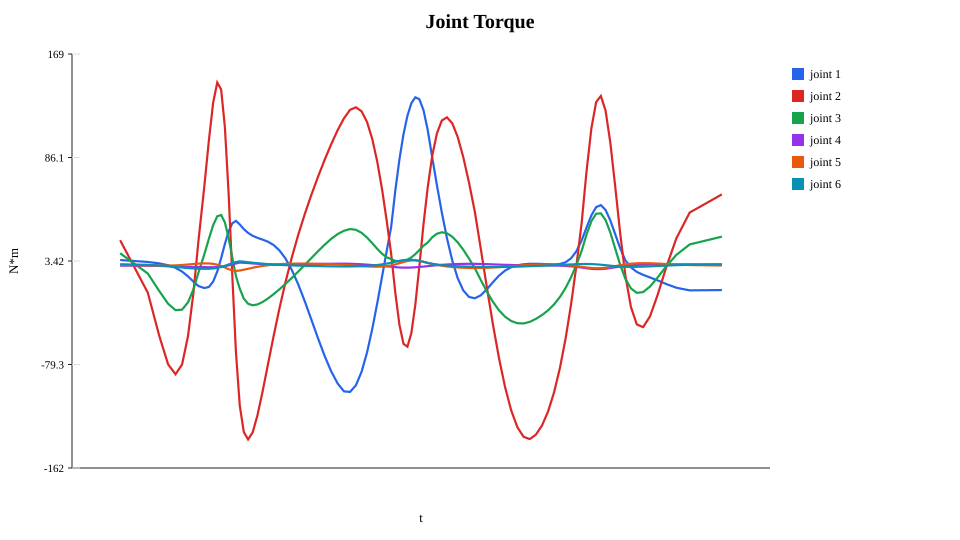
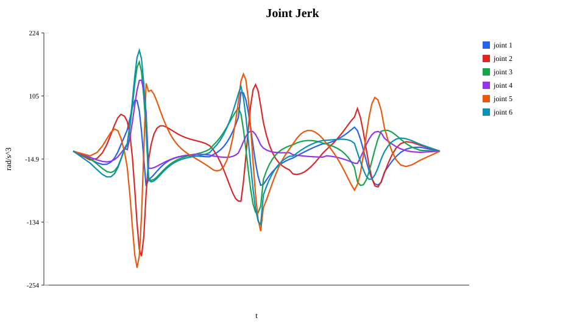
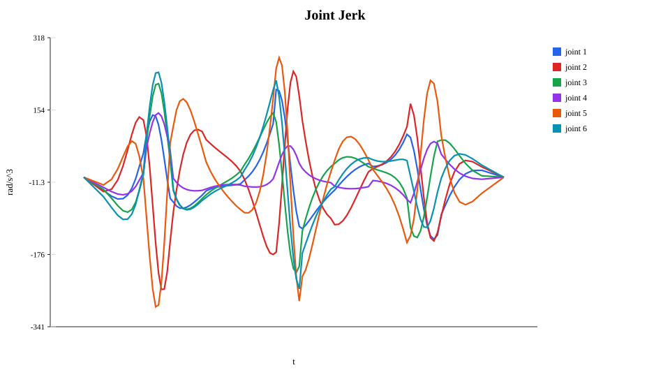
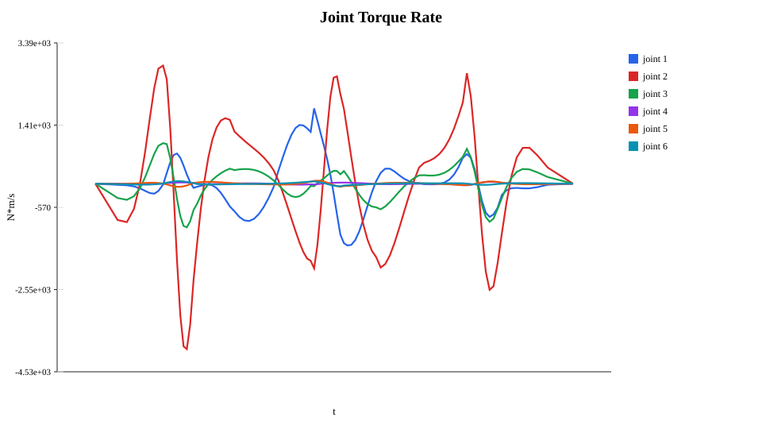
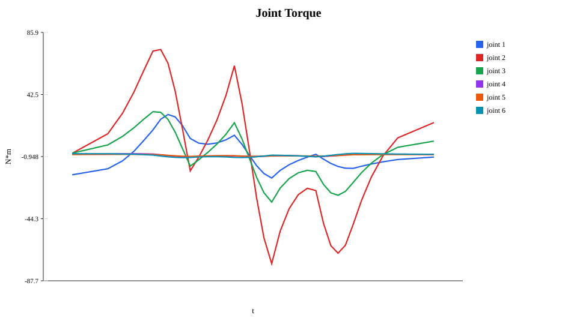
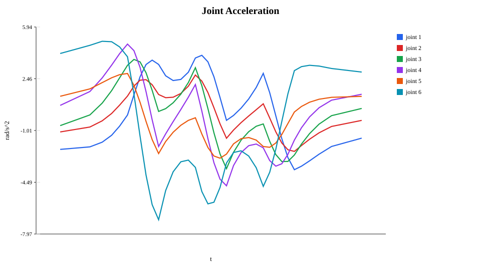

# DP3 复杂路径力矩与 jerk 约束测试图集

本文记录一组可复现的 DP3 复杂约束测试。这里把用户提到的“质可约束”按上下文解释为 jerk 约束；实验同时覆盖力矩约束、速度相关力矩下降约束、tight jerk 约束，以及二者组合约束。所有图都是关节数据曲线图，不使用装饰性图表。

## 目标

本实验用于回答三个问题：

1. DP3 在更多路径上是否能处理复杂关节运动。
2. 当力矩约束接近激活、尤其引入速度相关力矩下降时，关节力矩曲线是否仍受约束。
3. 当 jerk 上限收紧时，关节 jerk 曲线是否能保持在约束范围内。

## 运行方式

```powershell
python examples/complex_constraint_sweep.py
```

默认输出：

- `outputs/runs/dp3-complex-constraint-sweep/sweep_summary.csv`
- `outputs/runs/dp3-complex-constraint-sweep/sweep_summary.json`
- `outputs/runs/dp3-complex-constraint-sweep/gallery.html`
- `assets/complex-constraint-sweep/index.html`
- `assets/complex-constraint-sweep/*.svg`

`outputs/` 是生成数据，不纳入包发布；`assets/complex-constraint-sweep/` 中保留代表性 SVG，便于主页或文档展示。

## 路径选择

脚本会自动读取 `dyn - 副本/paths`，按关节空间长度和路径导数幅值选择更复杂的路径。默认包含：

- `long_path_01`：长复杂路径，关节空间长度显著高于常规路径。
- `path_14`
- `path_13`
- `path_12`

其中 `long_path_01` 使用更细的 DP 网格，常规路径使用较轻网格，避免整批实验运行时间过长。

## 约束场景

| 场景 | 含义 |
| --- | --- |
| `nominal` | 原始力矩与 jerk 限制。 |
| `torque_speed_drop` | 将力矩约束改成随关节速度下降的 velocity-dependent torque constraint。 |
| `tight_jerk` | 收紧 `q_jerk` 上下界，观察 jerk 曲线。 |
| `combined_torque_jerk` | 同时使用速度相关力矩下降和 tight jerk 约束。 |

## 代表性关节数据图

### 长复杂路径：速度相关力矩约束





### 长复杂路径：tight jerk 约束





### 常规复杂路径：组合约束





## 读图方式

每张图的横轴来自 run artifact 的采样点，通常是时间 `t` 或路径坐标 `s`；纵轴是对应关节物理量：

- `joint_velocity.svg`：`q_dot`
- `joint_acceleration.svg`：`q_ddot`
- `joint_jerk.svg`：`q_jerk`
- `joint_torque.svg`：`tau`
- `joint_torque_rate.svg`：`tau_rate`
- `constraint_utilization.svg`：各约束的归一化利用率

更完整的图集在：

```text
outputs/runs/dp3-complex-constraint-sweep/gallery.html
assets/complex-constraint-sweep/index.html
```

## 结论口径

这组图应按“约束压力测试”理解，而不是原论文数据复现。它使用当前仓库的 T12A MuJoCo 模型、`PathData` 路径和 `ConstraintLimits` 约束系统，重点展示 DP3 在更多路径、更强力矩和 jerk 条件下的关节数据曲线。
