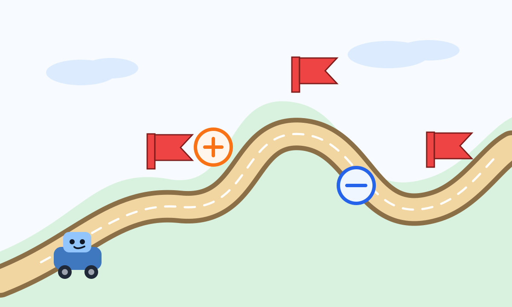
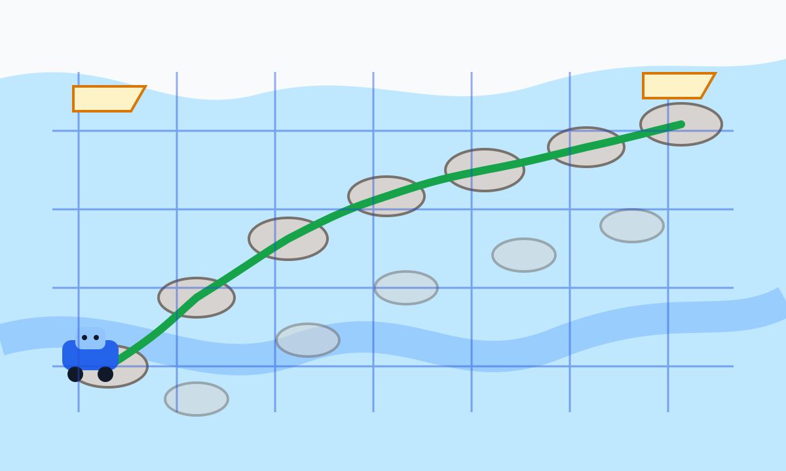
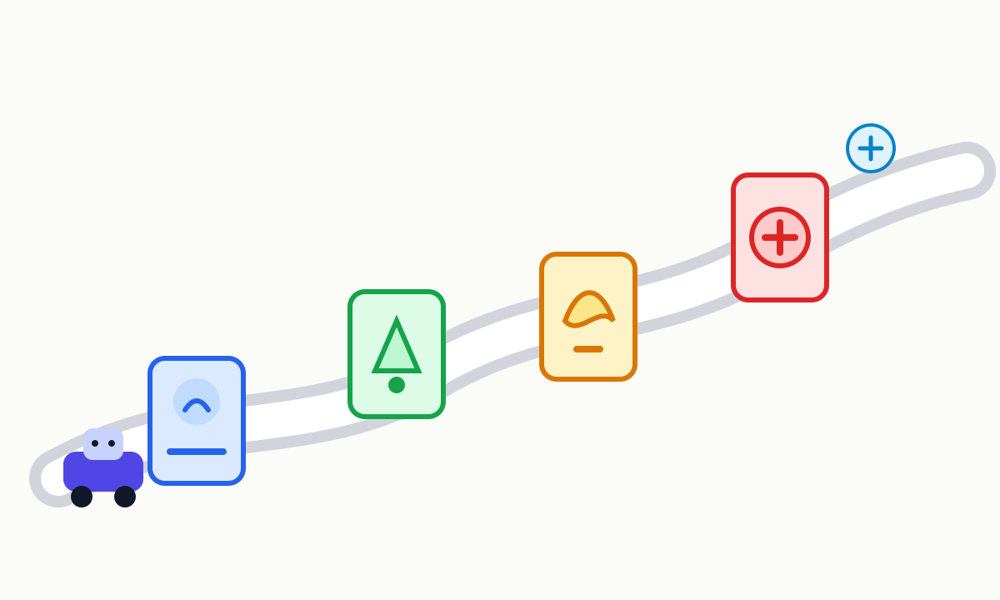
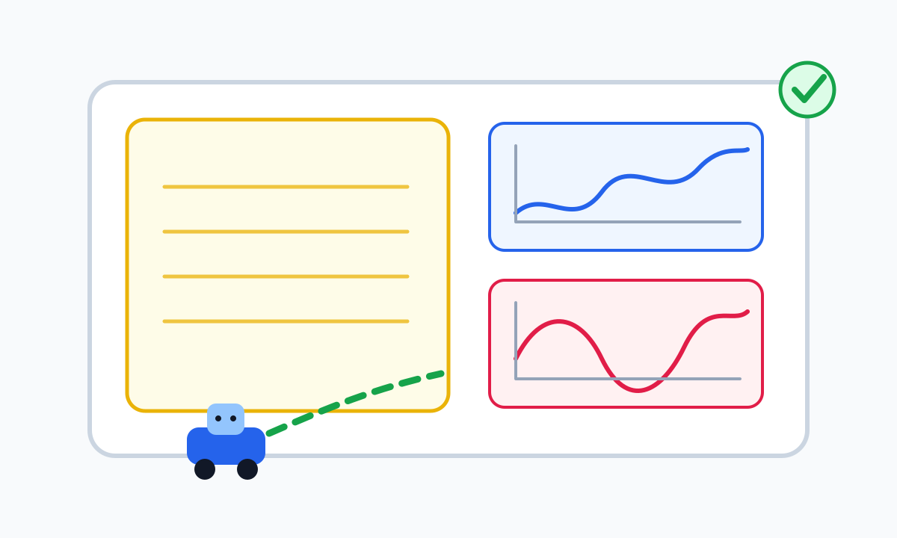

# DP3 算法实现过程：简单图文版

这份文档是给“先看懂大概，再去看源码”的读者准备的。它不追求公式完整，而是用几个比喻说明当前 `dp3-topp` 库到底怎样把一条机器人路径变成可执行的关节运动。

如果想看源码级细节，可以再读：

- `docs/dp3_algorithm_flow_zh.md`
- `docs/dp3_complex_constraint_sweep_zh.md`

## 1. 一句话理解

DP3 做的事像“给一辆机器人小车安排过山路”：

- 山路已经画好了，也就是关节路径 `q(s)`。
- 机器人不能太快、不能突然猛踩油门、不能猛拧方向，也就是速度、加速度、jerk、力矩等约束。
- DP3 要在这些规则下，找一条尽量快、但仍安全可执行的时间安排。



在代码里，这条“山路”不是普通地图，而是一条已经归一化到 `s = 0..1` 的关节路径。DP3 不改路径形状，它只决定：

```text
机器人在路径每个位置应该跑多快。
```

## 2. 输入：先有一条固定路线

核心输入是 `PathData`：

```text
s       路径进度，从 0 到 1
q       每个 s 上的关节位置
q_s     关节位置对路径进度的一阶导数
q_ss    二阶导数
q_sss   三阶导数
```

可以把它想象成一本路线册：

- 第 1 页写“走到哪里”。
- 第 2 页写“关节应该在哪”。
- 后面几页写“这条路弯不弯、急不急”。

DP3 拿到这本路线册后，不再重新规划空间路径，而是在这条路上安排时间。

## 3. 核心变量：不直接找速度，而是找 `z`

代码里最重要的变量是：

```text
z = s_dot^2
```

它表示路径速度的平方。为什么不直接用速度？因为用 `z` 后，很多约束检查会更稳定，也更适合动态规划。

可以把 `z` 理解成“这一步有多大劲儿往前走”：

- `z` 大：跑得快。
- `z` 小：跑得慢。
- `z = 0`：停住。

DP3 还会用：

```text
z_s   z 沿路径变化有多快
z_ss  z 的变化是否突然
```

这两个量让算法能检查 jerk 和力矩变化率这类更高阶约束。

## 4. 动态规划：像过河踩石头

DP3 会把路径分成很多段，把每个位置允许的 `z` 值也分成很多候选。这样就形成了一张网格：

```text
横向：路径位置 s
纵向：速度平方 z
每个点：一种“到这里时跑多快”的选择
```

可以把它想象成过河踩石头。每块石头是一种速度选择，DP3 要从起点踩到终点。



不是所有石头都能踩：

- 踩过去太快，会违反速度限制。
- 下一步变化太急，会违反加速度或 jerk。
- 机器人关节用力太大，会违反力矩。
- 力矩变化太猛，会违反力矩变化率。

代码里这一步主要在：

```text
optimizer.py
  optimize_dp3
  _optimize_grid
```

## 5. 每一小段路怎么连接

DP3 不只是选离散点，还要把相邻点之间连成平滑的小路。当前实现用了三种小段：

```text
C2LinearZ          简单直线段，适合起步和停下
C3QuadraticSpeed  普通中间段，负责平滑速度变化
C4CubicSpeed      起步后的衔接段，让斜率接得更顺
```

可以这样理解：

- C2 像“慢慢起步或慢慢刹停”。
- C3 像“路上稳定巡航，但也能转弯变速”。
- C4 像“从起步过渡到巡航的缓冲段”。

所以 DP3 的典型段结构是：

```text
起点 -> C2 -> C4 -> C3 -> C3 -> ... -> C2 -> 终点
```

这些段在代码里由 `interpolation.py` 负责。

## 6. 约束检查：每段路都要过关

每当 DP3 想从一块石头跳到下一块石头，它都会问一句：

```text
这一步机器人真的能做吗？
```

然后把这一步送去“守门人”检查。



守门人包括：

- 速度守门人：`q_dot`
- 加速度守门人：`q_ddot`
- jerk 守门人：`q_jerk`
- 力矩守门人：`tau`
- 力矩变化率守门人：`tau_rate`
- 功率守门人：`mechanical_power`
- 可选位置守门人：`q_position`

只有全部守门人都点头，这个候选段才会被动态规划保留下来。

代码里主要是：

```text
optimizer.py
  _audit_profile_segment
  _evaluate_dynamic_quantities

constraints.py
  audit_constraints
```

## 7. 力矩约束：不只是固定上限

力矩约束可以理解成机器人关节的“力气上限”。

普通理解是：

```text
力矩不能超过 tau_abs
```

但当前实现更细：如果配置了 `torque_speed_breakpoints`，力矩上限会跟关节速度有关。

这像人推车：

- 慢慢推，可以用更大力。
- 跑得越快，能持续输出的力反而可能下降。

所以代码检查力矩时，不是简单看 `tau / tau_abs`，而是看：

```text
tau / torque_bounds(q_dot)
```

这也是复杂约束图集中“速度相关力矩约束”的意思。

## 8. jerk 约束：不让动作突然发抖

速度表示快慢，加速度表示快慢变化，jerk 表示“加速度变化得有多突然”。

一个简单比喻：

- 速度太大：车跑太快。
- 加速度太大：突然猛踩油门。
- jerk 太大：油门一抖一抖，机器人动作不顺。

DP3 的优势之一就是它不是只管速度和加速度，还会在候选段中计算 `q_jerk`。这样能更早过滤掉动作突然的方案。

代码里 jerk 来自：

```text
kinematics.py
  path_time_derivatives
```

其中会把 `q_s/q_ss/q_sss` 和 `z/z_s/z_ss` 合在一起算出关节速度、加速度、jerk。

## 9. MuJoCo 动力学：算机器人真实需要多大力

如果传入 MuJoCo 模型，DP3 会调用：

```text
dynamics_mujoco.py
  MujocoRobotDynamics.inverse_dynamics
```

这一步相当于问机器人模型：

```text
如果我在这个姿态、这个速度、这个加速度下运动，每个关节要出多大力？
```

然后再估算力矩变化率：

```text
torque_rate_finite_difference
```

最后把摩擦也加进去，得到更接近真实执行的力矩和力矩变化率。

## 10. 输出：把路线账本变成关节数据图

当 DP3 找到一条可行速度安排后，会输出几类文件：

```text
trajectory.csv              路径速度 z 的结果
quantities.csv              关节速度、加速度、jerk、力矩等
constraint_utilization.csv  各约束利用率
constraint_violations.csv   如果有越界，列出越界点
summary.json                总结信息
```

这些文件再被画成关节数据曲线。



前面复杂约束测试图集就是从这些输出文件生成的。它展示：

- 长复杂路径下，力矩利用率可以接近 1。
- tight jerk 场景下，jerk 利用率也可以接近约束边界。
- 多条复杂路径、多种约束场景下，DP3 都能给出可行结果。

## 11. 从代码角度看完整流程

可以把实现过程压缩成下面 8 步：

```text
1. 读路径 CSV，得到 PathData
2. 读 limits.yaml，得到 ConstraintLimits
3. 可选读 MuJoCo XML，得到 MujocoRobotDynamics
4. 在路径 s 上建网格 grid_s
5. 在每个 s 上列出速度平方候选 grid_z
6. 反向动态规划，尝试所有相邻状态转移
7. 每个转移都生成 C2/C3/C4 小段并做约束检查
8. 找到最小代价路径后，重构轨迹并输出 CSV/JSON/SVG
```

对应源码入口：

```text
api.py
  run_dp3

optimizer.py
  optimize_dp3
  _optimize_grid
  _reconstruct_profile

plotting.py
  plot_run
```

## 12. 最简单的运行方式

库调用 demo：

```powershell
python examples/library_call_demo.py --out-dir outputs/demo_library_call
```

复杂约束图集：

```powershell
python examples/complex_constraint_sweep.py
```

完整测试：

```powershell
pytest -q
```

## 13. 记住这几个比喻

如果只想快速记住 DP3 的实现，可以记下面四句话：

1. `PathData` 是路线册。
2. `z = s_dot^2` 是每一步往前跑的劲儿。
3. 动态规划是在河里找一串安全踏脚石。
4. 约束审计是守门人，速度、jerk、力矩都过关才放行。

这样再回头看源码时，`_optimize_grid`、`C2/C3/C4`、`audit_constraints`、`quantities.csv` 这些名字就会更容易串起来。
